<div align="center">

# 비유 블로그 생성기

### 6-Agent 오케스트레이션 × Gemini 2.5 Flash × Excalidraw 손그림 파이프라인

[](https://blog-generator-production-5f73.up.railway.app/index.html)
[](https://python.org)
[](https://developer.mozilla.org)
[](https://ai.google.dev)
[](https://developers.google.com/blogger)
[](https://excalidraw.com)

<br/>

**기술 주제 한 줄**을 입력하면 **6개 AI 에이전트**가 비유 설계 → 글쓰기 → 팩트체크 → 평가까지 자동으로 수행하고,<br/>
손그림 다이어그램과 AI 생성 이미지가 포함된 완성된 블로그 포스트를 **Blogger에 즉시 발행**합니다.

[](https://blog-generator-production-5f73.up.railway.app/index.html)

[핵심 기능](#-핵심-기능) | [에이전트 아키텍처](#-에이전트-아키텍처) | [파이프라인 흐름](#-파이프라인-흐름) | [실행 방법](#-실행-방법)

<br/>

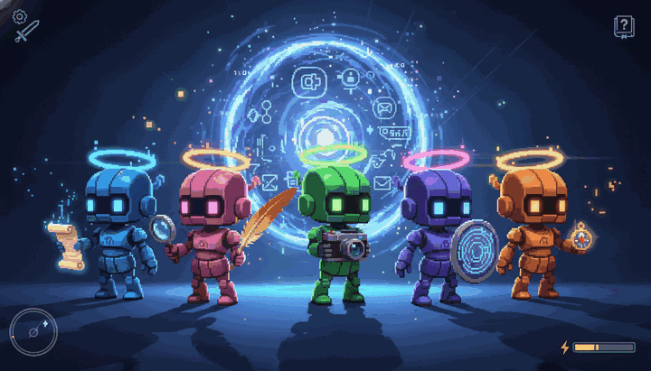

</div>

---

## 목차

- [프로젝트 소개](#-프로젝트-소개)
- [프로젝트 요약](#-프로젝트-요약)
- [핵심 기능](#-핵심-기능)
- [에이전트 아키텍처](#-에이전트-아키텍처)
- [파이프라인 흐름](#-파이프라인-흐름)
- [기술 스택](#-기술-스택)
- [Excalidraw 손그림 렌더링](#-excalidraw-손그림-렌더링)
- [신뢰성 보장](#-신뢰성-보장)
- [프로젝트 구조](#-프로젝트-구조)
- [실행 방법](#-실행-방법)
- [팀 소개](#-팀-소개)
- [참고 자료](#-참고-자료)

---

## 프로젝트 소개

> [!IMPORTANT]
> **"쉬운 비유는 전문가만 안다"** — 기술을 다른 세계의 구조로 1:1 매핑하는 건 자동화가 어려운 작업입니다. 본 프로젝트는 이를 **6개 전문 에이전트의 병렬 오케스트레이션**으로 해결합니다.

사용자가 기술 주제를 입력하면, **비유 설계 / 글 작성 / 이미지 프롬프트 / 검증 / 팩트체크 / 평가** 역할을 분리한 6개 LLM 에이전트가 단계별로 협력합니다. 최종 출력물에는 **Excalidraw 손그림 다이어그램**(한글 Gaegu 폰트), **AI 생성 이미지 3장**, **마크다운 테이블**이 포함되고, Blogger API로 즉시 발행됩니다.

### 문제 정의 & 해결책

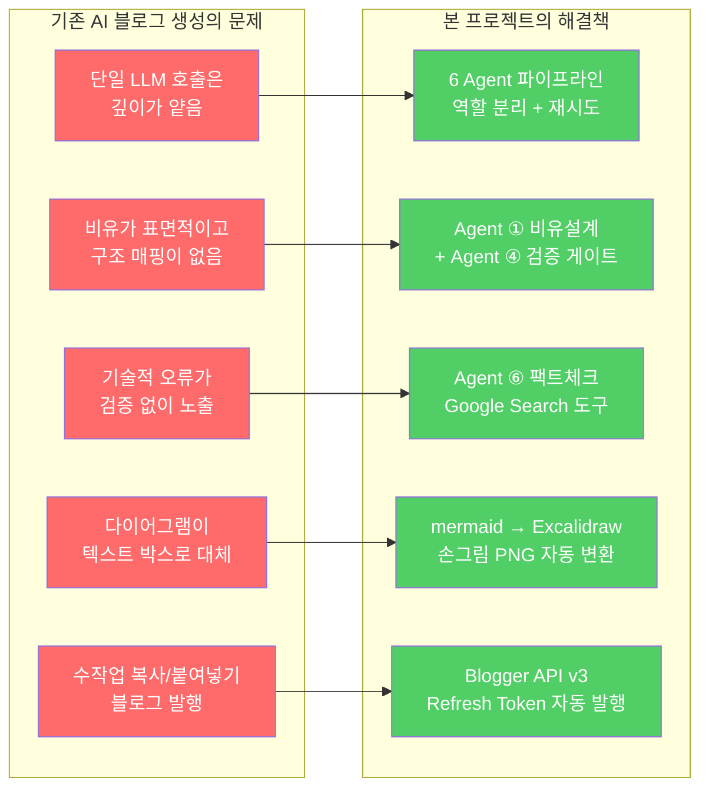

---

## 프로젝트 요약

본 프로젝트는 **기술 키워드 한 줄**을 입력하면 그림과 다이어그램이 포함된 완성된 한국어 블로그를 Blogger에 자동 발행하는 **엔드투엔드 AI 블로그 생성 플랫폼**입니다.

**6개 에이전트 오케스트레이션** 파이프라인 — 비유설계 / 글작성 / 이미지프롬프트 / 검증 / 평가 / 팩트체크 — 가 순차 실행되며 일부 단계는 병렬로 돌아갑니다. 각 에이전트는 Gemini 2.5 Flash (Lite)에서 **역할에 맞는 thinking budget과 temperature**로 독립 최적화되어 있습니다. 글작성 에이전트가 내놓은 모든 `mermaid` 코드블록은 **Excalidraw 손그림 렌더러**로 브라우저에서 PNG로 래스터화되고, 한글은 **Gaegu 손글씨 폰트**로 표시된 뒤 Imgur에 업로드되어 블로그에 삽입됩니다.

검증 에이전트는 **4단계 품질 게이트**(조사 → 측정 → 근거 → 판정)를 강제하고, 팩트체크 에이전트는 **Google Search 함수 호출**로 모든 기술 주장을 검증하며, 평가 에이전트는 7개 루브릭으로 최종 블로그를 채점합니다. 실패한 에이전트는 **실패 사유를 feedback으로 주입받아** 2~3회 개별 재시도됩니다. 최종 포스트는 **Blogger API v3의 Refresh Token 플로우**로 자동 발행됩니다.

---

## 핵심 기능

<div align="center">
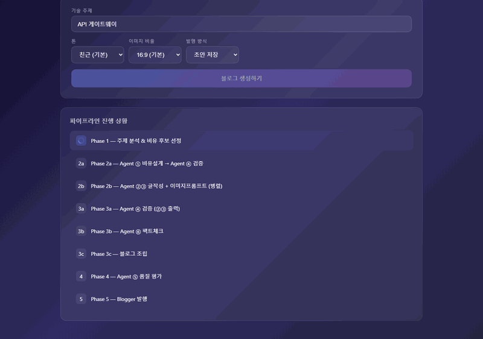
</div>

<br/>

### 1. 주제 → 블로그 자동 생성

기술 주제 한 줄 입력 → 3~5분 안에 완성된 블로그가 Blogger에 발행됩니다.

| 입력 | 자동 수행 | 출력 |
|:---:|:---|:---|
| `"MCP 서버"` | Phase 1~5 (6 Agent 순차/병렬) | Blogger 포스트 URL |
| 톤 오버라이드 | `친근` / `전문` / `유머` | 톤 맞춤 본문 |
| 비율 오버라이드 | `16:9` / `1:1` / `4:3` / `9:16` | AI 이미지 3장 |

### 2. 6-Agent 오케스트레이션

> [!TIP]
> 각 에이전트는 **역할·온도·thinking budget**이 전부 다릅니다. 구현 에이전트는 창의성(temp 0.7), 검증·평가는 결정론적(temp 0.0)으로 분리했습니다.

| # | 에이전트 | 역할 | Model | temp | thinking | 도구 |
|:---:|:---|:---|:---|:---:|:---:|:---:|
| ① | **비유설계** | 비유↔기술 구조 매핑 | Flash | 0.7 | 2048 | — |
| ② | **글작성** | 한국어 본문 생성 | Flash | 0.7 | 2048 | — |
| ③ | **이미지프롬프트** | intro/middle/outro | Lite | 0.7 | 0 | — |
| ④ | **검증** | 4단계 명세 검증 | Lite | 0.0 | 2048 | — |
| ⑤ | **평가** | 7-rubric 품질 채점 | Lite | 0.0 | 2048 | — |
| ⑥ | **팩트체크** | 기술 사실 확인 | Lite | 0.0 | 4096 | `google_search` |

### 3. Excalidraw 손그림 렌더링

> [!NOTE]
> 작성 에이전트가 출력한 `mermaid` 코드블록을 **브라우저에서 실시간**으로 Excalidraw 손그림 PNG로 변환합니다. 한글은 Gaegu 손글씨 폰트로 렌더링되고, 박스마다 파스텔 컬러 6색이 자동 로테이션됩니다.

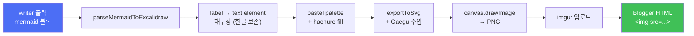

### 4. 신뢰성 게이트

| Gate | 시점 | 담당 | 조건 | 실패 시 |
|:---|:---|:---|:---|:---|
| **검증 A** | Phase 2a | Agent ④ | fitness ≥ 7, mapping 완전성 등 | Agent ① 재시도 (3회) |
| **검증 B** | Phase 3a | Agent ④ | 테이블 2+, 다이어그램 2+ | 원인 에이전트 재실행 |
| **팩트체크** | Phase 3b | Agent ⑥ | 기술 주장 F1~F4 통과 | Agent ② 재실행 |
| **평가** | Phase 4 | Agent ⑤ | 가중 평균 ≥ 3.5 | 구현 에이전트 재실행 (2회) |

### 5. Blogger API 자동 발행

- **Refresh Token 플로우** — 토큰 서버 저장, 5분 버퍼 자동 갱신
- **마크다운 → HTML** — 인라인 스타일 주입 (Blogger `<style>` sanitize 우회)
- **테이블 헤더 자동 보정** — LLM이 header 누락 시 sentinel 삽입 → 후처리 제거

---

## 에이전트 아키텍처

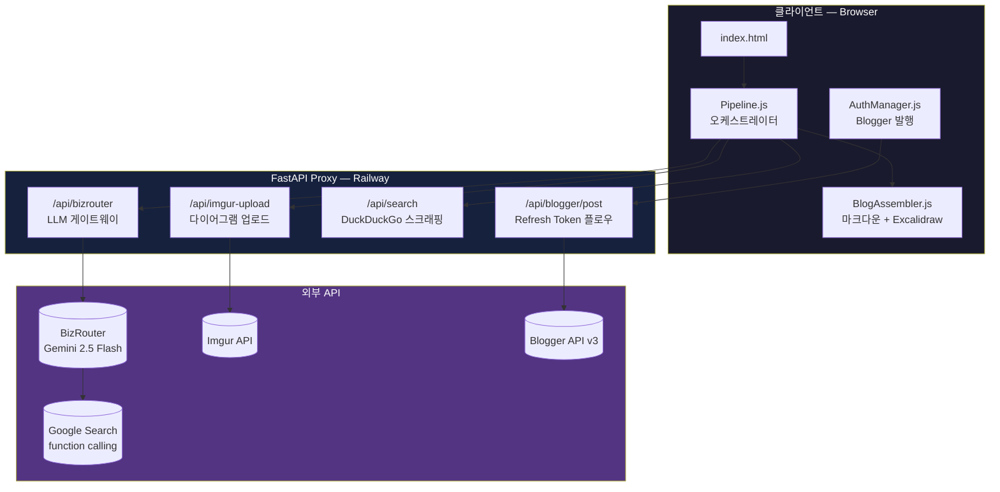

> [!NOTE]
> 모든 API 키는 **FastAPI 프록시 서버**에 격리됩니다. 클라이언트는 `BIZROUTER_KEY`, `IMGUR_CLIENT_ID`, `GOOGLE_REFRESH_TOKEN`을 절대 알지 못합니다.

---

## 파이프라인 흐름

### 전체 6-Agent 오케스트레이션

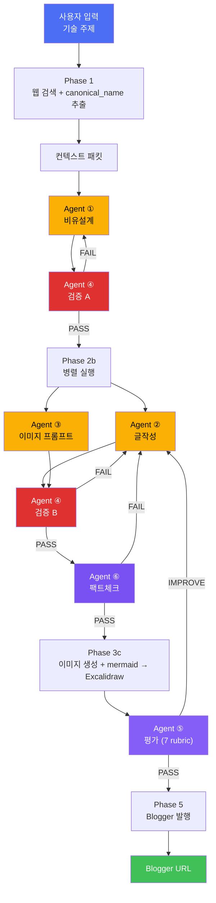

### Phase별 요약

| Phase | 이름 | 담당 | 결과물 |
|:---:|:---|:---|:---|
| **1** | 웹 검색 + 주제 분석 | Orchestrator | 컨텍스트 패킷 |
| **2a** | 비유설계 + 검증 A | Agent ① → ④ | 설계서 |
| **2b** | 글작성 + 이미지프롬프트 (병렬) | Agent ② + ③ | 본문 + 프롬프트 |
| **3a** | 검증 B | Agent ④ | verdict + fail list |
| **3b** | 팩트체크 | Agent ⑥ | PASS/FAIL |
| **3c** | 이미지 생성 + mermaid 변환 | Pipeline | 최종 조립물 |
| **4** | 품질 평가 | Agent ⑤ | 점수 + 개선안 |
| **5** | Blogger 발행 | AuthManager | 포스트 URL |

### AI 챗봇 계열 시퀀스 (Phase 2a 검증 재시도)

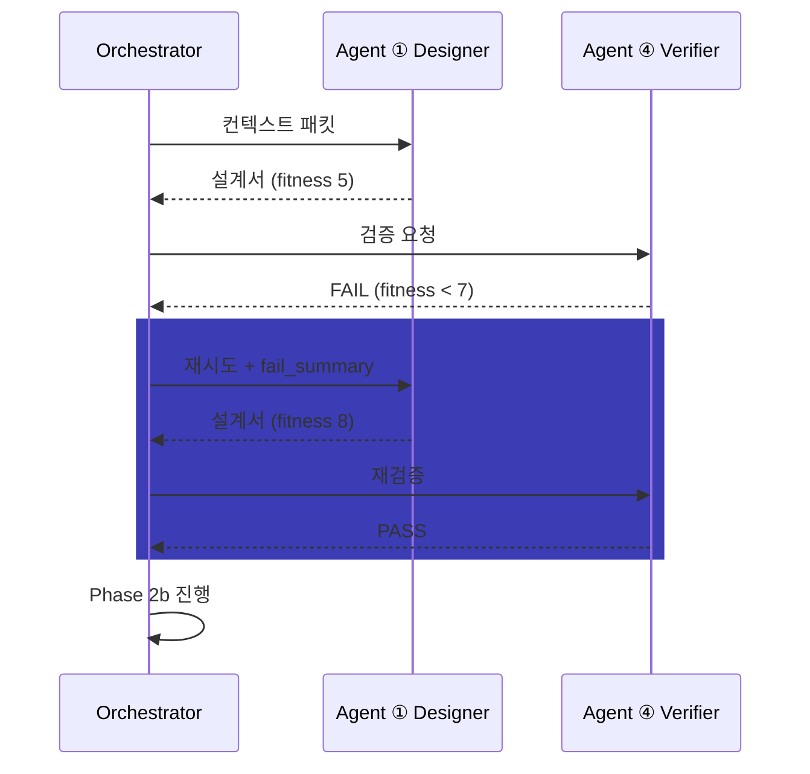

---

## 기술 스택

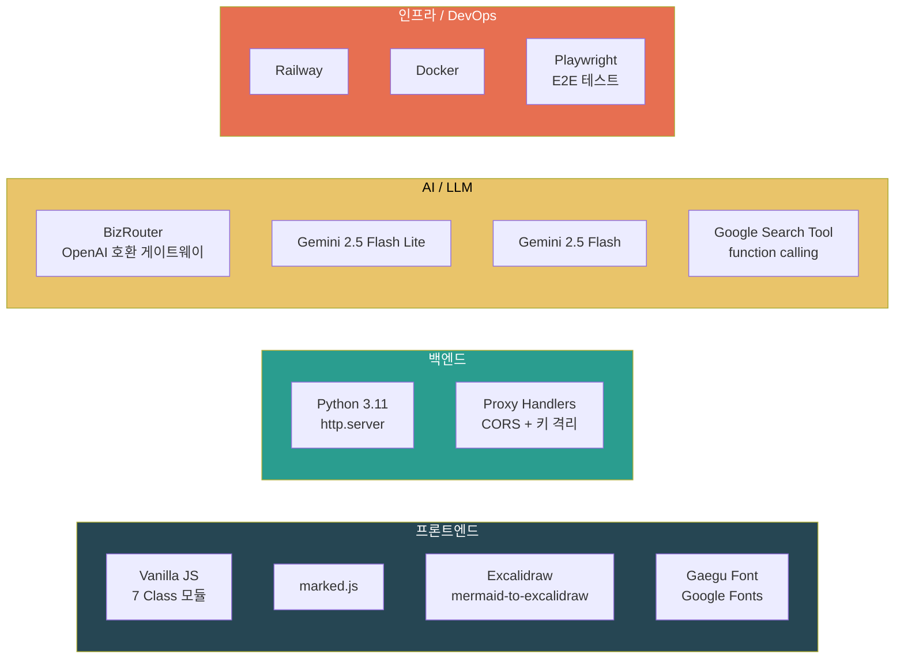

| 분류 | 기술 | 용도 |
|:---|:---|:---|
| **프론트엔드** | Vanilla JavaScript (ES2024) | 7개 Class 모듈 (Pipeline, BlogAssembler, ApiClient 등) |
| | marked.js | 마크다운 → HTML 변환 |
| | `@excalidraw/mermaid-to-excalidraw` | mermaid → Excalidraw skeleton |
| | `@excalidraw/excalidraw` | SVG/Canvas 렌더링 |
| | Gaegu (Google Fonts) | 한글 손글씨 폰트 |
| **백엔드** | Python 3.11 `http.server` | 경량 정적 파일 + 프록시 |
| | refresh_token flow | Blogger OAuth2 자동 갱신 |
| | DuckDuckGo HTML 스크래핑 | 주제 조사 (search 엔드포인트) |
| **LLM** | BizRouter | OpenAI 호환 LLM 게이트웨이 |
| | Gemini 2.5 Flash Lite | 검증 · 평가 · 팩트체크 (저지연 · 결정론) |
| | Gemini 2.5 Flash | 설계 · 작성 (심층 추론 + 창의성) |
| | `google_search` tool | 팩트체크 |
| **인프라** | Railway | 배포 (Docker + 환경변수) |
| | Docker | 컨테이너화 |
| | Playwright | E2E 스크립트 자동 테스트 |

---

## Excalidraw 손그림 렌더링

> [!IMPORTANT]
> 9번의 재검토 끝에 도달한 핵심 발견: `mermaid-to-excalidraw`는 라벨을 **속성으로만** 저장합니다. 한글이 렌더링 안 되는 건 폰트 문제가 아니라 **라벨이 text element로 확장되지 않아서**였습니다.

### 변환 파이프라인

```mermaid
flowchart TD
    MD["writer 출력<br/>&#96;&#96;&#96;mermaid graph TD..."] --> PARSE["mermaid-to-excalidraw<br/>parseMermaidToExcalidraw"]
    PARSE --> SK["skeleton 재구성<br/>label → text element"]
    SK --> STYLE["스타일 주입<br/>pastel 6색 + hachure + roughness 2"]
    STYLE --> CONT{"컨테이너?"}
    CONT -->|예| DASH["dashed 테두리<br/>배경 투명"]
    CONT -->|아니오| FILL["파스텔 채움<br/>두꺼운 테두리"]
    DASH & FILL --> CONV["convertToExcalidrawElements"]
    CONV --> SVG["exportToSvg"]
    SVG --> FONT["text[ko] → Gaegu 주입"]
    FONT --> RAST["SVG → Image → Canvas.drawImage"]
    RAST --> PNG["PNG dataURL"]
    PNG --> IMGUR["/api/imgur-upload"]
    IMGUR --> OUT["Blogger HTML &lt;img&gt;"]

    style MD fill:#4c6ef5,color:#fff
    style SK fill:#7950f2,color:#fff
    style FONT fill:#f76707,color:#fff
    style OUT fill:#40c057,color:#fff
```

### 컬러 팔레트

| Blue | Amber | Green | Pink | Indigo | Orange |
|:---:|:---:|:---:|:---:|:---:|:---:|
| `#dbeafe` | `#fef3c7` | `#dcfce7` | `#fce7f3` | `#e0e7ff` | `#ffedd5` |

### Sanitize 재시도

> [!WARNING]
> `A[Node.js (런타임)]`처럼 라벨에 `()`가 들어가면 mermaid 파서가 SQE 에러를 냅니다. 1차 실패 시 자동으로 괄호/따옴표/콜론을 제거한 뒤 재시도합니다.

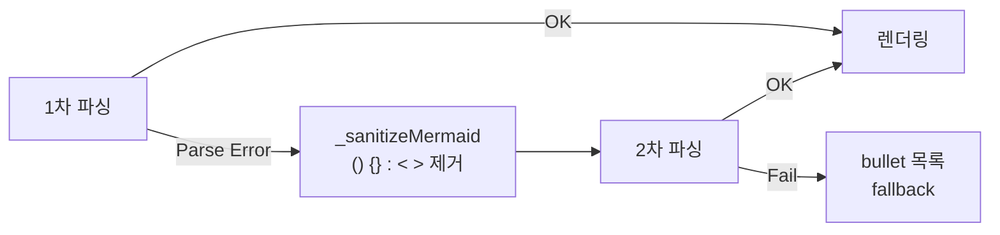

---

## 신뢰성 보장

### 재시도 정책

| 컴포넌트 | 재시도 | 전략 |
|:---|:---:|:---|
| Agent ① 비유설계 | 3회 | `fail_summary` feedback 주입 |
| Agent ② 글작성 | 2회 | 검증 실패 조항만 재수정 |
| Agent ③ 이미지 프롬프트 | 1회 | 단순 재호출 |
| LLM API (503 / 429 / 504) | 3회 | 지수 백오프 (2s → 4s → 8s) |
| mermaid 파싱 | 2회 | sanitize → bullet fallback |
| 팝업 차단 (window.open) | — | 중앙 모달 + 클릭 → 새 탭 |

### 테이블 렌더링 자동 보정

LLM이 마크다운 테이블 헤더 구분선(`|---|---|`)을 빠뜨리는 확률적 실패를 **후처리 레벨에서 차단**합니다.

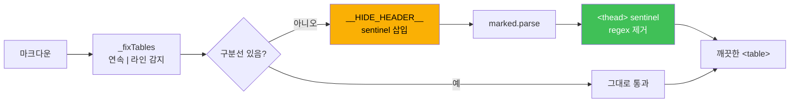

### 5 키워드 스트레스 테스트

| # | 키워드 | 결과 | 생성 시간 | 테이블 | mermaid |
|:---:|:---|:---:|:---:|:---:|:---:|
| 1 | Playwright | ✅ | 150s | 13 | 2 |
| 2 | MCP 서버 | ✅ | 297s | 14 | 2 |
| 3 | Node.js | ✅ | 185s | 11 | 2 |
| 4 | API | ✅ | 151s | 11 | 2 |
| 5 | 오픈클로 | ✅ | 161s | 14 | 2 |

> **성공률 5/5** — sanitize 재시도 / 검증 재시도 / 후처리 보정 모두 실제 트래픽에서 검증됨.

---

## 프로젝트 구조

```
blog-generator/
├── Dockerfile                 # Railway 배포용
├── server.py                  # Python http.server 프록시
│                              # - /api/bizrouter (LLM 게이트웨이)
│                              # - /api/imgur-upload
│                              # - /api/search (DuckDuckGo)
│                              # - /api/blogger/post (refresh token)
├── build.py                   # src/ → dist/index.html 번들러
├── dist/
│   └── index.html             # 번들된 SPA (CSS + JS 인라인)
└── src/
    ├── index.html             # 엔트리포인트
    ├── css/
    │   └── main.css           # 메인 스타일
    └── js/
        ├── config.js          # 모델 / API URL 설정
        ├── app.js             # 전역 바인딩 (window.pipeline 노출)
        ├── Pipeline.js        # 6-Agent 오케스트레이터 (Phase 1~5)
        ├── ApiClient.js       # BizRouter 호출 + 503 재시도
        ├── BlogAssembler.js   # 마크다운 + Excalidraw 변환
        ├── AuthManager.js     # Blogger 발행
        └── PipelineUI.js      # Phase 상태 / 비용 표시
```

---

## 실행 방법

### 사전 요구사항

> [!WARNING]
> `BIZROUTER_KEY`와 Blogger `GOOGLE_REFRESH_TOKEN`이 필요합니다. 없으면 LLM 호출과 발행이 동작하지 않습니다.

- Python 3.11+
- BizRouter API 키
- Google OAuth2 Client ID/Secret + Refresh Token (Blogger 발행용)
- Imgur Client ID (다이어그램 업로드용)

### 로컬 개발

```bash
# 1. 저장소 클론
git clone https://github.com/Technoetic/blog-generator.git
cd blog-generator

# 2. 환경 변수 설정
export BIZROUTER_KEY="your-key"
export GOOGLE_CLIENT_ID="..."
export GOOGLE_CLIENT_SECRET="..."
export GOOGLE_REFRESH_TOKEN="..."
export BLOGGER_BLOG_ID="..."
export IMGUR_CLIENT_ID="..."

# 3. 번들
python build.py   # src/ → dist/index.html

# 4. 서버 시작
python server.py

# 5. 브라우저 접속
open http://localhost:9090/index.html
```

### Docker 실행

```bash
docker build -t blog-generator .
docker run -p 9090:9090 \
  -e BIZROUTER_KEY=... \
  -e GOOGLE_REFRESH_TOKEN=... \
  -e BLOGGER_BLOG_ID=... \
  -e IMGUR_CLIENT_ID=... \
  blog-generator
```

### Railway 배포

> [!NOTE]
> `Dockerfile`이 포함돼 있어 `railway up` 한 번으로 자동 빌드됩니다. 환경 변수만 Railway 대시보드에 설정해 주세요.

```bash
railway variables --set BIZROUTER_KEY=... \
  --set GOOGLE_REFRESH_TOKEN=... \
  --set BLOGGER_BLOG_ID=... \
  --set IMGUR_CLIENT_ID=...
railway up
```

### 배포 흐름

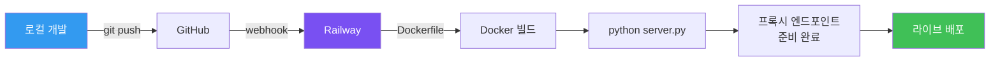

### 환경 변수

| Env | Required | Description |
|:---|:---:|:---|
| `BIZROUTER_KEY` | ✓ | LLM 게이트웨이 API 키 |
| `GOOGLE_CLIENT_ID` | ✓ | OAuth2 클라이언트 ID |
| `GOOGLE_CLIENT_SECRET` | ✓ | OAuth2 클라이언트 시크릿 |
| `GOOGLE_REFRESH_TOKEN` | ✓ | Blogger API 리프레시 토큰 |
| `BLOGGER_BLOG_ID` | ✓ | 대상 블로그 ID |
| `IMGUR_CLIENT_ID` | ✓ | Imgur 익명 업로드 클라이언트 |
| `PORT` | | 서버 포트 (기본 9090) |

---

## 사용 예시

**기본 사용**

```
"API 게이트웨이"에 대한 비유 블로그를 작성해줘
```

**톤 + 비율 오버라이드**

```
"API 게이트웨이"에 대한 비유 블로그를 작성해줘 (톤: 전문, 비율: 4:3)
```

**완료 후**: 화면 중앙에 🎉 **블로그 발행 완료** 모달이 뜹니다. `[블로그 열기]` 버튼 클릭 → 새 탭에서 Blogger 포스트가 열립니다.

---

## 팀 소개

<table>
<tr align="center">
<td>
<a href="https://github.com/Technoetic">

<br/><b>전문준</b>
</a>
<br/>풀스택 · 에이전트 오케스트레이션 · Excalidraw 파이프라인
</td>
</tr>
</table>

---

## 참고 자료

<details>
<summary><b>핵심 개념 & 논문</b></summary>

| 주제 | 설명 |
|:---|:---|
| **Structure Mapping Theory** (Gentner, 1983) | 비유를 기술↔대응 구조의 일관된 매핑으로 해석하는 이론 — Agent ①의 토대 |
| **LLM-as-Judge** (Zheng et al., 2023) | LLM이 다른 LLM의 출력을 평가 — Agent ④⑤의 토대 |
| **Tool Use / Function Calling** (Schick et al., 2023) | LLM이 외부 도구를 호출하는 패턴 — Agent ⑥ + `google_search` |
| **Prompt Caching** (Anthropic, 2024) | 불변 프롬프트 앞단 고정으로 캐시 적중률 최적화 — messages 배열 순서 설계 |

</details>

<details>
<summary><b>기술 참고</b></summary>

- [BizRouter](https://bizrouter.ai) — OpenAI 호환 LLM 게이트웨이
- [Gemini API](https://ai.google.dev)
- [Blogger API v3](https://developers.google.com/blogger)
- [mermaid-to-excalidraw](https://github.com/excalidraw/mermaid-to-excalidraw)
- [Excalidraw](https://excalidraw.com)
- [Gaegu Font](https://fonts.google.com/specimen/Gaegu)

</details>

---

<div align="center">

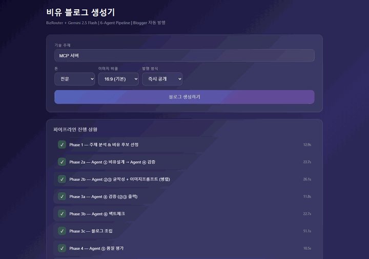

<br/>

**비유로 배우는 기술 블로그 — 읽는 이의 머릿속에 이미 그려진 그림을 활용합니다**

[](https://railway.app)

</div>
